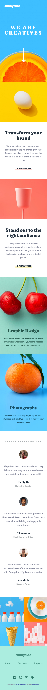
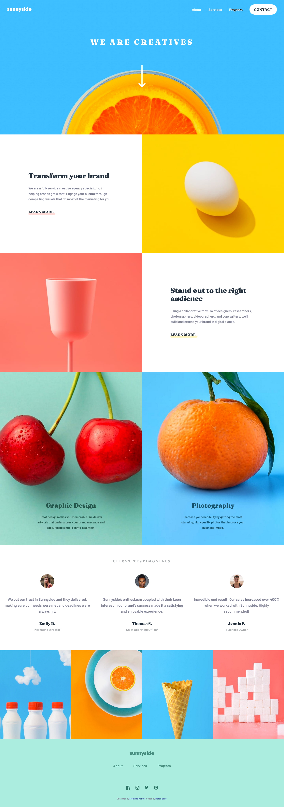

# Frontend Mentor - Sunnyside agency landing page solution

This is a solution to the [Sunnyside agency landing page challenge on Frontend Mentor](https://www.frontendmentor.io/challenges/sunnyside-agency-landing-page-7yVs3B6ef). Frontend Mentor challenges help you improve your coding skills by building realistic projects.

## Table of contents

- [Overview](#overview)
  - [The challenge](#the-challenge)
  - [Screenshot](#screenshot)
  - [Links](#links)
- [My process](#my-process)
  - [Built with](#built-with)
  - [Useful resources](#useful-resources)
- [Author](#author)

## Overview

### The challenge

Users should be able to:

- View the optimal layout for the site depending on their device's screen size
- See hover states for all interactive elements on the page

### Screenshot

### Links

- Solution URL: [[https://www.frontendmentor.io/solutions/responsive-landing-page-CJtUGlLpcn](https://www.frontendmentor.io/solutions/responsive-landing-page-CJtUGlLpcn)]
- Live Site URL: [[https://sunnyside-agency-landing-page-main-seven.vercel.app/)](https://sunnyside-agency-landing-page-main-seven.vercel.app/)]

## My process

### Built with

- Semantic HTML5 markup
- CSS custom properties
- Flexbox
- CSS Grid
- Mobile-first workflow
- [SCSS](https://sass-lang.com/) - CSS extension

### Useful resources

- [Text shadow](https://developer.mozilla.org/en-US/docs/Web/CSS/text-shadow) - This helped me to set hover state on navigation text with text shadow.

## Author

- Frontend Mentor - [@martinelias1312](https://www.frontendmentor.io/profile/martinelias1312)
- LinkedIn - [@Martin Eliáš](https://www.linkedin.com/in/martin-eli%C3%A1%C5%A1-455550209/)
